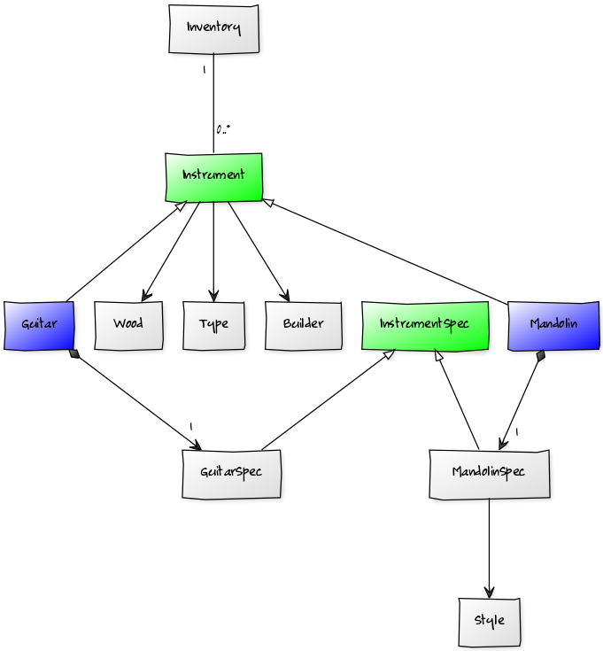
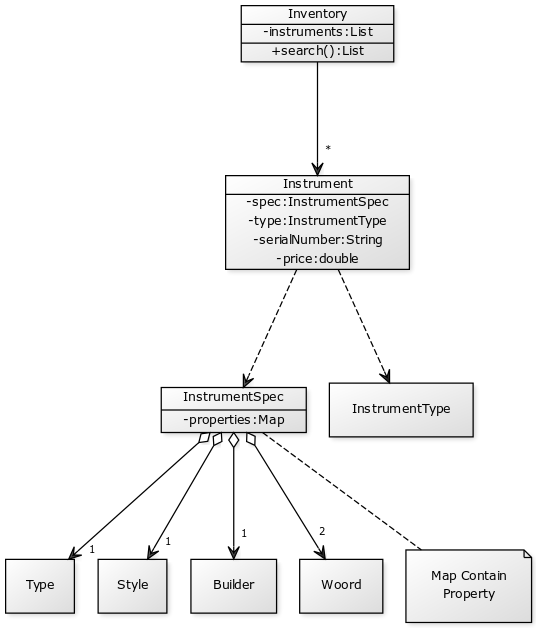

# 面向对象基础
## UML与类图（Class Diagram）
UML用来将程序代码与应用程序结果的必要细节传给其他开发者与客户，
@方便沟通！
## 继承（inheritance）
继承让你基于其他类来构建类，避免重复及反复出现的代码。
## 多态（polymorphism）
多态与继承紧密相关，当一个类基础另一个类时，多态让子类能代替父类。
## 封装（encapsulation）
封装：将编程元素（programming elements）包含在较大、较抽象的实体内的过程，也成为信息隐藏（information hiding）或关注点分离（seperation of concerns）
封装是讲部分数据对应用程序的其余部分隐藏起来，并且限制程序代码其余部分访问该数据的能力。

	* 封装是将类的实现隐藏起来，好让它容易使用与改变。
	* 封装让类以黑盒（Black Box）的方式提供服务给它的用户，但不开放该程序代码让其他人改变或者以错误的方式使用它。
	* 封装是遵循开闭原则（OCP）的关键技术。

# 第一章 伟大软件的开始

## 什么是伟大软件？

	* 让客户满；
	* 设计良好（well-designed）、编码良好的（well-coded）且易于维护、重用及扩展；

## 伟大软件的简易三步骤
### 需求分析：确认你的软件做客户要它做的事；（用例图）
#### 用例（步骤列表）
用例是捕捉新系统或软件变更的潜在需求的技术。每个用例提供一个或多个场景（scenario）,传达系统如何与终端用户（end user）或其他系统交互以实现特定目标。
一个好的用例包含3个部分：

	* 清楚的价值（clear value）：助于客户实现目标
	* 起点与终点（starting point/stopping point）：每个用例都必须有明确的起点和终点。某件事开始此流程，然后要有条件（condition）指明此流程已完成。
	* 外部启动者（external initiator）：每个用例由外部启动者开启。有时启动者是人，有时可能是系统外的任何事物。

替换路径：当事情出错时，你必须有替换路径达到系统的目标。

### 设计模式/OO原则：运用基本的OO原则来增加软件的灵活性；（类图/时序图）
为正在解决的问题用文字描述清楚，确保你的设计与应用程序想实现的功能一致；
任何时候看到重复程序代码，就找个地方进行封装；

### 重构：努力实现可维护、可重用的设计；（组件关系图/部署结构图）

# 需求变更

	* 好的需求确保你的系统如客户预期的那样运作；
	* 确认需求涵盖了系统的所有用例；
	* 运用用例找出客户忘了告诉你的事；
	* 用例将揭露任何不完整、遗漏的需求，你可能需要将它们加到你的系统中；

# 分析

	* 分析帮助你确保系统运作在真实世界的情境里；
	* 以对客户、老板及自己合理的方式编写你的用例；
	* 分析及用例让你给客户、经理和其他开发者展示系统在真实世界的情境里如何运作；
	* 查看用例里的名词（与动词）以整理出类与方法的动作叫做文本分析（textual analysis）；
	* 用例里的名词是系统的类候选者，而动词是系统类上的方法的候选者；
	* 好的用例以容易理解的语言，清楚且准确地解释系统在做什么；有了良好、完整的用例，文本分析是整理出系统所需类的简单且快速的方式。
	* 类图以很粗略的系统概述给你 一个简单的方式展示你的系统以及它的程序代码构想。

# 良好的设计 诸行无常
抽象类：抽象类是实际的实现类的占位符（placeholder），抽象类定义行为，而子类实现该行为；
每当你在两个或两个以上的地方找到共同行为时，小心的将该行为抽取到一个类里，然后以此共同类重用这项行为；

OO原则

	* 将变化之物封装起来；
	* 对接口编码，而不是对实现；
	* 应用程序中的每一个类只有一个改变的理由；

